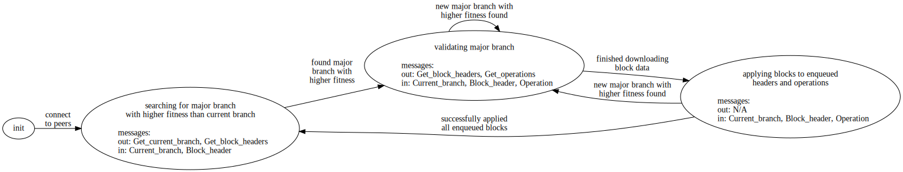

# Bootstrapping TLA+ spec

Each bootstrapping node sends three types of messages:

- `Get_current_branch` - request a peer's current head and a sample of their history
- `Get_block_headers` - request the headers corresponding to the given list of block hashes
- `Get_operations` - request the operations with the given hashes

and receives three types of messages:

- `Current_branch` - node's respond with their current head and sample of history
- `Block_header` - node's respond with the requested header or do not respond
- `Operation` - node's respond with the requested operation or do not respond

## Phase diagram

[](./phase_diagram.dot.svg)

## Assumptions/Simplifications

- all messages are for the same `chain_id`
- all headers are for the same `proto_level`
- no `timestamp`s
- only three message types:
  - `Get_current_branch`/`Current_branch`
  - `Get_block_headers`/`Block_header`
  - `Get_operations`/`Operation`
- i.e. no `Current_head` or mempool
- bootstrapping nodes have the ability to request a specific history sample, by levels
- bootstrapping nodes only communicate with established nodes
- node's are blacklisted when we timeout while communicating with them, no matter the cause
- lengths of all chains are bounded
- number of operations per block is bounded

## Constants/Parameters

- `BAD_NODES` - byzantine nodes
- `GOOD_NODES` - nodes who follow the protocol
- `BAD_BOOTSTRAPPING` - byzantine bootstrapping nodes
- `GOOD_BOOTSTRAPPING` - bootstrapping nodes who follow the protocol
- `MIN_PEERS` - minimum number of peers
- `MAX_PEERS` - maximum number of peers
- `MAX_LEVEL` - maximum level of a block
- `MAX_OPS` - maximum number of operations per block
- `CURRENT_HEAD` - each good node's current head
- `BLOCKS` - each good node's blocks
- `VALIDATOR` - Blocks -> { "known_valid", "known_invalid", "unknown" }
- `SAMPLES` - GOOD_NODES \X Bootstrapping_nodes -> Seq_n(Levels)
- `HASH_BLOCK_MAP` - BlockHashes -> Headers

## Variables

### Bootstrapping

#### Local

Each bootstrapping node [bn] has:

- `phase` - the state of [bn]
- `connections` - set of nodes with whom [bn] may exchange messages
- `current_head` - current head (initially `genesis` header)
- `level_to_validate` - ???
- `validated_blocks` - set of validated blocks to add to [bn]'s chain
- `header_pipe` - 
- `operation_pipe` - 


#### Knowledge

- `chain_lengths` - length of each connection's chains
- `fitness_witnessed` - 
- `fittest_head` - 

#### History

Each bootstrapping node [bn] has the following history variables:

- `phase_trace` - trace of each phase experienced
- `sent_get_branch` - set of nodes from whom [bn] has requested current branch
- `sent_get_headers` - 
- `sent_getops` - 
- `recv_branch` - 
- `recv_header` - 
- `recv_operation` - 

#### Memory/Space

- `mem_size`

### Node 

Each good node has:

- `n_blacklist` - 
- `n_messages` - 
- `serving_headers` - headers which have been requested by bottstrapping nodes
- `serving_ops` - operations which have been requested by bootstrapping nodes

#### History

Each good node keeps a collection of each type of data sent and received:

- `sent_branch`
- `sent_headers`
- `sent_ops`
- `recv_get_branch`
- `recv_get_header`
- `recv_get_ops`

### Searching for major branch

The bootstrapping node has sufficiently many connections

- Doing:
  - high priority: requesting current branches from all peers
  - low prioity: requesting block headers of received block hashes
  - attempting to find a header that a majority of peers have in their chain

- Not doing:
  - not requesting operations
  - not applying blocks 

### Validating a major branch

The bootstrapping node has seen majority peer support for a header

The bootstrapping node only needs to download each (header, operations) pair once and cross-validate against peer hashes

- Doing:
  - requesting latest block headers within a suffix of the major branch
  - requesting corresponding operations
  - cross-validating a portion of the history
  - enqueuing headers and operations in the pipes

- Not doing:
  - not applying blocks

If a new major header (with higher fitness) is found during this phase:

- adjust `current_head`
- adjust level of validation phase
- if on the same branch, keep the same requests and add any new ones
- if not on the same branch, delete requests down to common branch and add new ones

### Applying blocks

The bootstrapping node has received all requested headers and operations for the target suffix

- Doing:
  - continue enqueuing headers and operations into the pipes
  - applying blocks

- Not doing:
  - not requesting branches
  - not requesting headers
  - not requesting operations

If a new major header (with higher fitness) is found during this phase:

- adjust `current_head`
- return to validation phase
- if on the same branch, keep everything in the pipes and add any new headers/operations
- if not on the same branch, delete headers and operations in pipes down to the common branch

## Properties

### Safety

- bootstrapping connections

```
/\ Cardinality(connections[bn]) >= MIN_PEERS
/\ Cardinality(connections[bn]) <= MAX_PEERS
```

- hello

### Liveness

- 


## Performance

### Memory

- will ultimately include memory usage estimates in 
