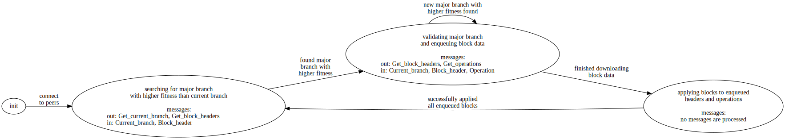

# Bootstrapping TLA+ spec

Each bootstrapping node sends three types of messages:

- `Get_current_branch` - request a peer's current head and a sample of their history
- `Get_block_headers` - request the headers corresponding to the given list of block hashes
- `Get_operations` - request the operations with the given hashes

and receives three types of messages:

- `Current_branch` - node's respond with their current head and sample of history
- `Block_header` - node's respond with the requested header or do not respond
- `Operation` - node's respond with the requested operation or do not respond

## Assumptions/Clarifications/Simplifications

- all messages are for the same `chain_id`
- all headers are for the same `proto_level`
- no `timestamp`s
- only three message types:
  - `Get_current_branch`/`Current_branch`
  - `Get_block_headers`/`Block_header`
  - `Get_operations`/`Operation`
  - i.e. no `Current_head` or mempool
- bootstrapping nodes only communicate with established nodes
- node's are blacklisted when we timeout while communicating with them, no matter the cause
- lengths of all chains are bounded
- number of operations per block is bounded

## Constants/Parameters

- `BAD_NODES` - byzantine nodes
- `GOOD_NODES` - nodes who follow the protocol
- `BAD_BOOTSTRAPPING` - byzantine bootstrapping nodes
- `GOOD_BOOTSTRAPPING` - bootstrapping nodes who follow the protocol
- `MIN_PEERS` - minimum number of peers
- `MAX_PEERS` - maximum number of peers
- `MAX_LEVEL` - maximum level of a block
- `MAX_OPS` - maximum number of operations per block

- `CURRENT_HEAD` - each good node's current head
- `BLOCKS` - each good node's blocks
- `SAMPLES` - each good node's samples for each bootstrapping node

## Variables

### Bootstrapping

Each bootstrapping node `bn` has:

- `b_blacklist` - set of `bn`'s blacklisted peers
- `b_messages` - set of `bn`'s messages

#### Local

Each bootstrapping node `bn` has:

- `phase` - the state of `bn`, governs the actions taken by `bn`
- `connections` - set of nodes with whom `bn` may exchange messages
- `current_head` - `bn`'s current fittest header with majority support (initially `genesis` header)
- `fittest_head` - the fittest header of each of `bn`'s peers
- `header_pipe` - queue of validated headers to form blocks
- `operation_pipe` - queue of validated operations to form blocks
- `prevalidated_hds` - set of headers on the major branch which are ready to add to `header_pipe`
- `prevalidated_ops` - set of operations on the major branch which are ready to add to `operation_pipe`
- `validated_blocks` - set of validated blocks to add to `bn`'s chain

#### History

Each bootstrapping node `bn` has the following history variables:

- `phase_trace` - trace of each phase experienced

- `sent_get_branch` - set of nodes from whom `bn` has requested a current branch
- `sent_get_headers` - set of requested (level, block hash) pairs from each of `bn`'s peers
- `sent_get_ops` - set of requested (block hash, operation hash) pairs from each of `bn`'s peers
- `recv_branch` - set of samples ((level, block hash) pairs) received from each of `bn`'s peers
- `recv_header` - set of (block hash, header) pairs received from each of `bn`'s peers
- `recv_operation` - set of (block hash, operations) pairs received from each of `bn`'s peers

### Node 

Each good node has:

- `n_blacklist` - set of blacklisted peers
- `n_messages` - set of messages
- `serving_headers` - headers which have been requested by bootstrapping nodes
- `serving_ops` - operations which have been requested by bootstrapping nodes

#### History

Each good node keeps a collection of each type of data sent and received:

- `sent_branch` - set of (level, block hash) pairs sent to each peer who has requested a `Current_branch`
- `sent_headers` - set of headers sent to each peer who has requested a `Block_header`
- `sent_ops` - set of operations sent to each peer who has requested an `Operation`
- `recv_get_branch` - set of peers who have requested the current branch
- `recv_get_headers` - set of (level, block hash) pairs each peer has requested the corresponding header for
- `recv_get_ops` - set of (block hash, operation hash) pairs each peer has requested the corresponding operation for

## Phases

### Searching for a major branch

The bootstrapping node has sufficiently many connections

- Doing:
  - requesting current branches from all peers
  - requesting block headers of received block hashes
  - attempting to find a header that a majority of peers claim to have in their chain

- Not doing:
  - not requesting operations
  - not applying blocks 

### Validating a major branch

The bootstrapping node has seen majority peer support for a header

The bootstrapping node downloads each (header, operations) pair, cross-validates against peer hashes if possible, and determines majority support before adding either to the prevalidated sets

- Doing:
  - requesting block headers within a suffix of the major branch
  - requesting corresponding operations
  - cross-validating a portion of the history
  - moving headers and operations to the prevalidated sets

- Not doing:
  - not enqueuing headers/operations
  - not applying blocks

If a new major header (with higher fitness) is found during this phase:

- adjust `current_head`
- adjust level of validation phase
- wil be on the same branch by majority rule, keep the same requests and add any new ones

### Applying blocks

The bootstrapping node has received all requested headers and operations for the target suffix

- Doing:
  - enqueuing headers and operations into the pipes
  - applying blocks

- Not doing:
  - not requesting any data
  - not handling any messages

## Properties

### Safety

- bootstrapping connections

```
\A bn \in GOOD_BOOTSTRAPPING :
  /\ num_peers(bn) <= MAX_PEERS
  /\ b_blacklist[bn] \cap connections[bn] = {}
```

- bootstrapping messages

```
\A bn \in GOOD_BOOTSTRAPPING :
  { msg.from : msg \in b_messages } \subseteq connections[bn]
```

- phase consistency

```
\A bn \in GOOD_BOOTSTRAPPING :
  LET p == phase[bn] IN
  /\ p \notin Phase_init => num_peers(bn) >= MIN_PEERS
  /\ \E l \in Levels :
      p = major_phase(1..l) <=> l = highest_major_level(bn)
  /\ \E l \in Levels :
      p = apply_phase(1..l) <=> l = highest_major_level(bn)
```

- current_head consistency

```
\A bn \in GOOD_BOOTSTRAPPING :
  /\ 2 * Cardinality({ n \in good_conns(bn) : current_head[bn] \in good_headers(n) }) > Cardinality(good_conns(bn))
  /\ highest_major_level(bn) = 0 => current_head[bn] = gen_header
```

### Liveness

- fitness is monotonic increasing

```
\A bn \in GOOD_BOOTSTRAPPING :
  LET old_head == current_head[bn]
      new_head == current_head'[bn]
  IN
  [][ old_head /= new_head => old_head.fitness < new_head.fitness ]_vars
```

- allowable transitions

```
\* Init -> Search
\A bn \in GOOD_BOOTSTRAPPING :
  LET old_phase == phase[bn]
      new_phase == phase'[bn]
  IN
  [][ /\ old_phase \in Phase_init
      /\ old_phase /= new_phase
      =>
      /\ new_phase \in Phase_search
      /\ connections[bn] = {}
      /\ connections'[bn] /= {} ]_vars
```

```
\* Search -> Major
\A bn \in GOOD_BOOTSTRAPPING :
  LET old_phase == phase[bn]
      old_head  == current_head[bn]
      new_phase == phase'[bn]
      new_head  == current_head'[bn]
  IN
  [][ /\ old_phase \in Phase_search
      /\ old_phase /= new_phase
      =>
      /\ new_phase \in Phase_major
      /\ old_head.fitness < new_head.fitness
      /\ old_head.level < new_head.level ]_vars
```

```
\* Major -> { Major, Apply }
\A bn \in GOOD_BOOTSTRAPPING :
  LET old_phase == phase[bn]
      old_head  == current_head[bn]
      new_phase == phase'[bn]
      new_head  == current_head'[bn]
  IN
  \* Major -> Apply
  /\ [][ (old_phase \in Phase_major) => new_phase \in Phase_major \cup Phase_apply ]_vars
  \* Major -> Major
  /\ [][ \E l \in Levels :
          /\ old_phase = major_phase(1..l)
          /\ old_head.level = l
          /\ new_phase \in Phase_major
          =>
          \E k \in Levels :
              /\ k > l
              /\ new_head.level = k
              /\ new_phase = major_phase(1..k) ]_vars
```

```
\* Apply -> Search
\A bn \in GOOD_BOOTSTRAPPING :
  LET old_phase == phase[bn]
      old_head  == current_head[bn]
      new_phase == phase'[bn]
      new_head  == current_head'[bn]
  IN
  /\ [][ /\ old_phase \in Phase_apply
         /\ new_phase /= new_phase
          => new_phase \in Phase_search \cup Phase_major ]_vars
```

- if progress can be made, it will be

```
\A bn \in GOOD_BOOTSTRAPPING :
  LET curr_hd == current_head[bn] IN
  \E hd \in major_headers(bn) :
      <>( \/ hd = curr_hd
          \/ hd.fitness < curr_hd.fitness )
```

## Inductive invariants

An *inductive invariant* is a special type of invariant that respects induction, i.e. if the property holds in the initial state and the n-th state, then it will hold again in the (n + 1)-th state.

We like to formulate safety properties as inductive invariants and use the symbolic model checker for TLA+, [Apalache](https://apalache.informal.systems/), to verify them.

## Phase diagram

[](./phase_diagram_vertical.dot.svg)
